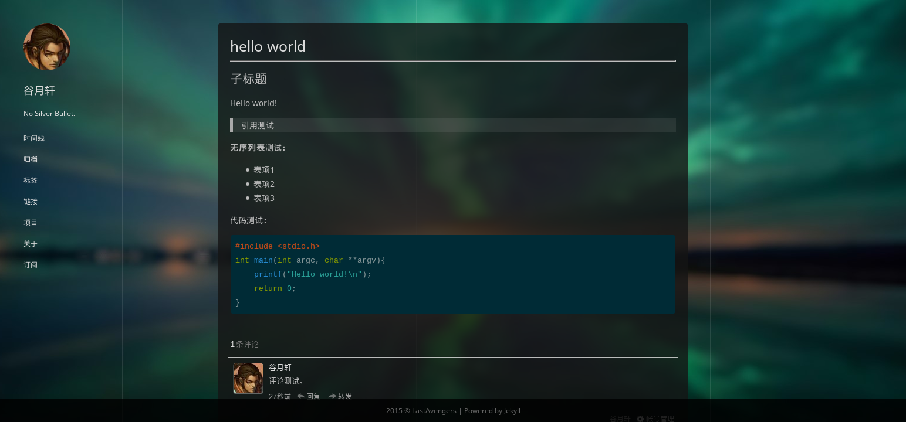

silk-jekyll-theme
====
A simple jekyll theme.



## 依赖：
* ruby-jekyll
* ruby-rdiscount
* a javascript runtime (such as nodejs)

## 自定义

* 在 `_includes/commentbox` 中填入你的评论框代码（建议使用[多说](http://duoshuo.com/)）
* 在 `_includes/blog-stat` 中填入你的网站统计代码
* 修改 `_config.yml` 以修改网站的元信息

    ```yml
    name: 博客名称
    description: 博客描述
    url: 博客地址
    avatar: 头像地址
    ```

* 在 links.md 中增加一条友情链接：

    ```liquid
    
    ```

* 链接到指定的友情链接：

    ```liquid
    
    ```

* 增加一张 Github Card：

    ```liquid
    
    ```

## License
MIT License

## 外部资源
* 包含了旧版本的 [highlight.js](https://highlightjs.org/)
* 包含了来自 LOFTER 的 图片资源： `assets/icon.png` `assets/line.png`，版权归网易 LOFTER 所有
* 包含的背景图片 `assets/background.jpg` 出处不明
